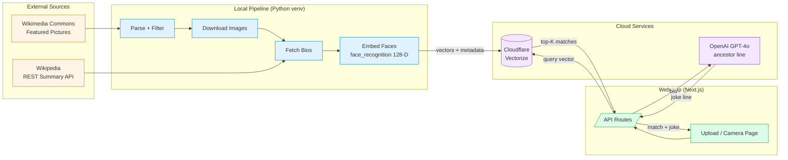
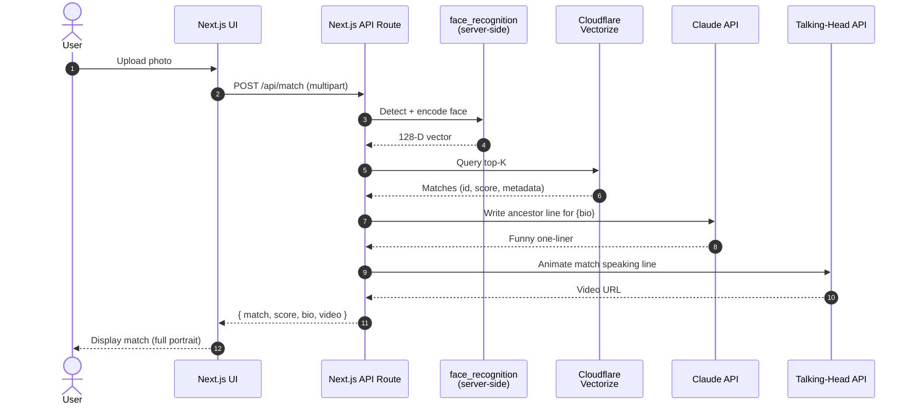

# Historical Portrait Lookalike

> Upload a photo of yourself or a friend, find the historical figure you most resemble, and watch them come to life saying _"I'm your ancestor — I left you some goats in your inheritance."_


A hackathon project that builds a curated dataset of historical portraits, embeds each face into a vector space, and serves nearest-neighbor look-alike matches through a small web app. The matched portrait is then animated by a talking-head API speaking an LLM-generated "ancestor" line tailored to that person's biography.

---

## How the data gets there



---

## Pipeline Phases

| # | Phase | Status | Output |
|---|---|---|---|
| 1 | Dataset assembly: parse Wikimedia gallery, filter to named historical figures, download images | ✅ Done | 243 images in `wikimedia_portraits/images/` |
| 2 | Bio enrichment via Wikipedia REST summary API | ✅ Done | 243 JSON bios in `wikimedia_portraits/bios/` |
| 3 | Face embedding (`face_recognition`, dlib's 128-D encoding) | 🔧 Running | `embeddings.ndjson` in Vectorize format |
| 4 | Cloudflare Vectorize index + bulk insert | ⏳ Next | `wrangler vectorize` commands |
| 5 | Next.js API routes for upload + match | ⏳ Next | `/api/match` endpoint |
| 6 | Next.js upload UI | ⏳ Planned | Web page |
| 7 | LLM "ancestor" line generation (Claude API) | ⏳ Planned | Per-match dynamic text |
| 8 | Talking-head animation | ⏳ Planned | Animated video output |

---

## Architecture

### Three logical layers

**1. Data layer (offline Python scripts).** Pulls source material from Wikimedia and Wikipedia, filters and curates it locally, computes face embeddings. All raw and processed data lives under `wikimedia_portraits/`.

**2. Vector layer (Cloudflare Vectorize).** Stores 128-D face embedding vectors with metadata (name, bio fields, image URL) for fast nearest-neighbor lookup. The same Vectorize index is queried at request time by the Next.js app.

**3. Application layer (Next.js).** Web app accepts a user-uploaded photo, computes a face embedding for it (server-side via the same `face_recognition` library), queries Vectorize for top-K matches, calls Claude to write a funny "ancestor" line from the matched bio, and finally hands the matched image + line to a talking-head API for the animated video.

### Why face_recognition (not CLIP)

We initially planned to use CLIP via Replicate but pivoted to `face_recognition`'s 128-D dlib face encoding. CLIP embeds whole-image visual style — sepia palettes, paint texture, composition — which would consistently match modern color selfies against other modern selfies, not against historical *faces*. `face_recognition` is identity-trained: it ignores lighting, era, and background, focusing on facial geometry. Trade-off: we lose CLIP's "vibes" (era-aware) component, but match quality is the priority for a look-alike demo.

### User-facing query flow



The user always sees the **full original portrait**, not the cropped face that drove the embedding.

---

## Repository Layout

```
.
├── wikimedia_portraits.py        # Phase 1: scrape + filter + download
├── fetch_bios.py                 # Phase 2: enrich with Wikipedia bios
├── embed_faces.py                # Phase 3: detect + encode faces (face_recognition)
├── upload_to_vectorize.py        # Phase 4: bulk-insert vectors (planned)
├── wikimedia_portraits/
│   ├── images/                   # 243 source portraits (~42 MB) — shown to user
│   ├── bios/                     # 243 JSON bios (~2 MB) — metadata source
│   ├── manifest.csv              # flat index linking images ↔ bios
│   ├── embeddings.ndjson         # generated: Vectorize-format vector records
│   ├── embed_results.csv         # generated: per-image embedding report
│   ├── .wiki_cache.json          # cache (gitignored)
│   └── bios/.bio_cache.json      # cache (gitignored)
├── app/                          # Next.js frontend (planned)
├── venv/                         # Python virtual environment (gitignored)
├── .env                          # local secrets — gitignored
├── .env.example                  # committed template
├── .gitignore
└── README.md
```

---

## Setup

### Prerequisites

- Python 3.10+ (tested on 3.12)
- Node.js 20+ (for the Next.js app — Phase 5+)
- Wrangler CLI: `npm i -g wrangler`
- A [Cloudflare](https://cloudflare.com) account with Vectorize enabled
- A [Replicate](https://replicate.com) account if you plan to use Replicate for the talking-head step (optional)
- An [Anthropic](https://console.anthropic.com) API key for Claude (Phase 7)

### One-time setup

1. **Clone and create an isolated Python venv** — important on systems with anaconda or other base Pythons, because `face_recognition` pins specific dlib/numpy versions:
   ```bash
   git clone <this repo>
   cd hackathon
   python3 -m venv venv
   venv/bin/pip install --upgrade pip
   venv/bin/pip install requests Pillow numpy mediapipe python-dotenv replicate \
       face_recognition 'git+https://github.com/ageitgey/face_recognition_models' \
       'setuptools<80'
   ```
   The `setuptools<80` pin is needed because `face_recognition_models` still uses the legacy `pkg_resources` API which was removed in setuptools 80+.

2. **Configure secrets:**
   ```bash
   cp .env.example .env
   # then edit .env and paste your real REPLICATE_API_TOKEN (and ANTHROPIC_API_KEY when you reach Phase 7)
   ```

3. **Authenticate Cloudflare:**
   ```bash
   wrangler login
   wrangler whoami        # confirm
   ```

### Running the pipeline

Each step uses the venv Python — either prefix every command with `venv/bin/` or `source venv/bin/activate` first.

```bash
# Phase 1: scrape, filter, download (~5 min, rate-limited)
venv/bin/python wikimedia_portraits.py

# Phase 2: fetch bios
venv/bin/python fetch_bios.py

# Phase 3: embed faces
venv/bin/python embed_faces.py

# Phase 4: create Vectorize index and insert vectors
wrangler vectorize create historical-portraits --dimensions=128 --metric=cosine
wrangler vectorize insert historical-portraits --file=wikimedia_portraits/embeddings.ndjson
```

---

## Data Pipeline Scripts

### `wikimedia_portraits.py` — Phase 1

Scrapes [Commons:Featured Pictures / Historical / People](https://commons.wikimedia.org/wiki/Commons:Featured_pictures/Historical/People), extracts ~419 gallery entries, applies a multi-step name extractor (handling "Self-portrait of …", honorifics, photographer credits, parentheticals, pose phrases), and looks each candidate up in Wikipedia. Only entries that resolve to a `type=standard` Wikipedia article are kept (~243 named historical figures after manual curation). Survivors are downloaded at 800px width with retry-on-429 backoff.

```bash
venv/bin/python wikimedia_portraits.py --filter-only   # dry-run: show counts and samples
venv/bin/python wikimedia_portraits.py                 # full run: filter + download
```

Output: `wikimedia_portraits/images/{slug}.jpg`, `wikimedia_portraits/manifest.csv`

### `fetch_bios.py` — Phase 2

Reads the manifest, calls Wikipedia's REST summary endpoint for each `wikipedia_title`, and writes one self-contained bio JSON per person. Each record includes the canonical name, short description, paragraph summary, image path, and source URLs — ready for direct DB upload.

```bash
venv/bin/python fetch_bios.py
```

Output: `wikimedia_portraits/bios/{slug}.json`

Sample:
```json
{
  "slug": "Edgar_Allan_Poe__circa_1849__restored__squared_off",
  "name": "Edgar Allan Poe",
  "description": "American writer and critic (1809–1849)",
  "summary": "Edgar Allan Poe was an American writer, poet, editor, and literary critic...",
  "image_local": "images/Edgar_Allan_Poe__circa_1849__restored__squared_off.jpg",
  "wikipedia_url": "https://en.wikipedia.org/wiki/Edgar_Allan_Poe"
}
```

### `embed_faces.py` — Phase 3

For each portrait in the manifest:
1. Detects the face with `face_recognition.face_locations()` — HOG by default, falling back to the slower CNN model if HOG misses (often happens on stylized paintings or unusual lighting).
2. If multiple faces are detected, picks the largest by bounding-box area.
3. Computes the 128-D face encoding and packages it as a Cloudflare Vectorize record with metadata pulled from the bio JSON.

```bash
venv/bin/python embed_faces.py
```

Output:
- `wikimedia_portraits/embeddings.ndjson` — one Vectorize-format record per line
- `wikimedia_portraits/embed_results.csv` — per-image report (status, face count)

Vectorize record format:
```json
{
  "id": "Edgar_Allan_Poe__circa_1849__restored__squared_off",
  "values": [0.123, -0.456, ...],
  "metadata": {
    "name": "Edgar Allan Poe",
    "description": "American writer and critic (1809–1849)",
    "portrait_date": "ca. 1849",
    "image_local": "images/Edgar_Allan_Poe__circa_1849__restored__squared_off.jpg",
    "image_url": "https://upload.wikimedia.org/...",
    "wikipedia_url": "https://en.wikipedia.org/wiki/Edgar_Allan_Poe",
    "summary": "Edgar Allan Poe was an American writer..."
  }
}
```

---

## Why This Stack

**Why Wikimedia Featured Pictures?** Curated for image quality, mix of photographs and high-res painted portraits, broad public-domain availability, and (after a Wikipedia-resolution filter) a known-name pool that supports biography lookup.

**Why face_recognition (dlib's 128-D encoding)?** Identity-trained on faces, runs entirely locally, no per-query API cost, and produces vectors purpose-built for nearest-neighbor matching of facial similarity. Better signal-to-noise than CLIP for this exact task — see "Architecture > Why face_recognition (not CLIP)" above.

**Why Cloudflare Vectorize?** It pairs naturally with a Next.js app deployed to Cloudflare Pages / Workers, supports cosine similarity out of the box, the free tier covers far more than this project's scale, and the Worker binding gives the API route sub-50ms query latency from the edge.

**Why a 243-vector dataset?** Small enough to hand-curate (we manually deleted four group-photo entries that wouldn't face-match well), large enough to give plausibly varied matches across user photos.

---

## Known Limitations

- **Painted portraits embed less reliably than photographs.** `face_recognition`'s underlying model was trained on photos. ~70% of the dataset is 19th–20th century photographs (good); the rest are painted portraits where the CNN-fallback detection sometimes still misses. Any "no_face" rows in `embed_results.csv` get dropped from the Vectorize index.
- **Some Wikipedia matches are wrong-person.** The name-extraction heuristics will occasionally pick a different famous person sharing the name (e.g., a famous "Smith" rather than the obscure 19th-century Smith pictured). Visible in the manifest as a mismatch between `original_caption` and `wikipedia_title`.
- **Modern selfies vs century-old portraits is an out-of-distribution match.** Even with identity-focused embeddings, the domain gap (color/B&W, lighting, camera, makeup, pose) means top matches are loose look-alikes, not perfect doubles. For a comedy demo this is fine — and arguably preferable.

---

## Acknowledgements

- **Source images**: [Wikimedia Commons Featured Pictures / Historical / People](https://commons.wikimedia.org/wiki/Commons:Featured_pictures/Historical/People), licensed mostly public domain or CC-BY-SA.
- **Source bios**: Wikipedia REST API summaries, licensed CC-BY-SA 3.0.
- **Face encoding**: [`face_recognition`](https://github.com/ageitgey/face_recognition) (Adam Geitgey) — wraps dlib's 128-D face encoder.
- **Vector store**: [Cloudflare Vectorize](https://developers.cloudflare.com/vectorize/).
