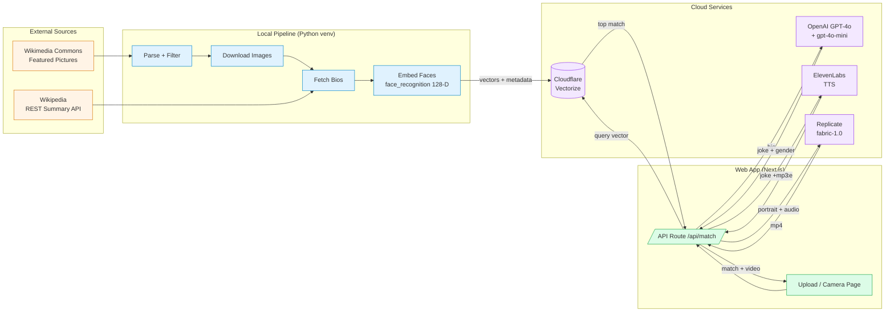
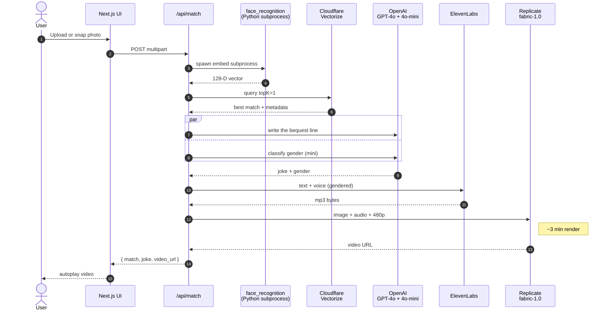

# Find Your Inheritance

> Upload a photo of yourself or a friend, find the historical figure you most resemble, and watch them come to life saying _"I'm your great-uncle — I left you 47 demanding ravens."_


Built in a day at a Productbuildersclub event hosted at Fabrik. Curated 243 historical portraits, embedded each face into a 128-D space, indexed them in Cloudflare Vectorize, and stitched together a Next.js app that finds your closest match and animates the painting saying a one-line bequest written by GPT-4o, voiced by ElevenLabs, lipsynced by Replicate's `veed/fabric-1.0`.

---

## How the data gets there



---

## Pipeline Phases

| # | Phase | Output |
|---|---|---|
| 1 | Scrape Wikimedia gallery, filter to named historical figures, download images | 243 portraits in `wikimedia_portraits/images/` |
| 2 | Bio enrichment via Wikipedia REST summary API | 243 JSON bios in `wikimedia_portraits/bios/` |
| 3 | Face embedding (`face_recognition`, dlib's 128-D encoding) | `embeddings.ndjson` |
| 4 | Cloudflare Vectorize index + bulk insert (241 vectors after face-detection drops) | live index `historical-portraits` |
| 5 | Next.js API route: face embedding + Vectorize query | `/api/match` |
| 6 | OpenAI GPT-4o joke + gpt-4o-mini gender classification (parallel) | one-line bequest, voice gender |
| 7 | ElevenLabs TTS for the bequest line (~10s mp3) | audio |
| 8 | Replicate `veed/fabric-1.0` lipsync at 480p (~3 min render) | mp4 video |
| 9 | Next.js upload + camera UI, autoplay video result | live web app |

All shipped.

---

## Architecture

### Three logical layers

**1. Data layer (offline Python scripts, run once).** Pulls source material from Wikimedia and Wikipedia, filters and curates it locally, computes face embeddings, writes Vectorize-format NDJSON. All raw and processed data lives under `wikimedia_portraits/`.

**2. Vector layer (Cloudflare Vectorize, always-on).** Stores 128-D face embedding vectors with metadata (name, description, summary, image path, Wikipedia URL) for fast nearest-neighbor lookup. Queried at request time by the Next.js app via the Cloudflare REST API.

**3. Application layer (Next.js).** Web app accepts a user-uploaded photo, computes a face embedding for it (server-side `face_recognition` via Python subprocess), queries Vectorize for the top match, fires GPT-4o + gpt-4o-mini in parallel for the joke + gender, sends the joke to ElevenLabs for audio, and finally hands the matched portrait + audio to Replicate's `fabric-1.0` for the lipsync video.

### Why face_recognition (not CLIP)

Initial plan was CLIP via Replicate. Pivoted to `face_recognition`'s 128-D dlib encoding before any embedding ran, because CLIP embeds **whole-image visual style** — sepia palettes, paint texture, composition — and would have consistently matched modern color selfies against other modern selfies, not against historical *faces*. `face_recognition` is identity-trained: it ignores lighting, era, and background, focusing on facial geometry. Trade-off: we lose CLIP's "vibes" (era-aware) component, but match quality is the priority for a look-alike demo.

### User-facing query flow



The user always sees the **full original portrait**, not the cropped face that drove the embedding.

---

## Repository Layout

```
.
├── wikimedia_portraits.py        # Phase 1: scrape + filter + download
├── fetch_bios.py                 # Phase 2: enrich with Wikipedia bios
├── embed_faces.py                # Phase 3: detect + encode faces (gallery)
├── embed_user.py                 # called by Next.js as a subprocess at request time
├── embed_service/                # FastAPI + Dockerfile (cloud-hosting alt for embed_user.py)
│   ├── main.py
│   ├── requirements.txt
│   ├── Dockerfile
│   └── README.md
├── wikimedia_portraits/
│   ├── images/                   # 243 source portraits (~42 MB) — shown to user
│   ├── bios/                     # 243 JSON bios (~2 MB)
│   ├── manifest.csv              # flat index linking images ↔ bios
│   ├── embeddings.ndjson         # generated: Vectorize-format vector records
│   └── embed_results.csv         # generated: per-image embedding report
├── web/                          # Next.js 16 app
│   ├── app/
│   │   ├── page.tsx              # upload + camera UI, result side panel
│   │   ├── layout.tsx            # Space Grotesk + Space Mono + Doto fonts
│   │   ├── globals.css           # Nothing-design tokens
│   │   └── api/
│   │       ├── match/route.ts    # full pipeline orchestrator
│   │       └── portrait/[slug]/  # serves images from wikimedia_portraits/
│   ├── .env.example
│   └── package.json
├── venv/                         # Python virtual environment (gitignored)
├── .env.example                  # template for root-level Python env
├── .gitignore
└── README.md
```

---

## Setup

### Prerequisites

- Python 3.10+ (tested on 3.12)
- Node.js 20+ (Next.js 16)
- Wrangler CLI: `npm i -g wrangler`
- A [Cloudflare](https://cloudflare.com) account (Vectorize is free at this scale)
- An [OpenAI](https://platform.openai.com/) API key (used for the joke + gender classification)
- An [ElevenLabs](https://elevenlabs.io) API key with `text_to_speech` permission
- A [Replicate](https://replicate.com) account + token (`veed/fabric-1.0` lipsync)

### One-time setup

1. **Clone and create an isolated Python venv** — important on systems with anaconda or other base Pythons because `face_recognition` pins specific dlib/numpy versions that fight with system-wide installs:
   ```bash
   git clone https://github.com/pranavred/findyourinheritance
   cd findyourinheritance
   python3 -m venv venv
   venv/bin/pip install --upgrade pip
   venv/bin/pip install requests Pillow numpy python-dotenv \
       face_recognition 'git+https://github.com/ageitgey/face_recognition_models' \
       'setuptools<80'
   ```
   The `setuptools<80` pin is needed because `face_recognition_models` still uses the legacy `pkg_resources` API which was removed in setuptools 80+.

2. **Configure secrets:**
   ```bash
   cp .env.example .env
   # edit .env: paste your real REPLICATE_API_TOKEN

   cd web
   cp .env.example .env.local
   # edit .env.local: OPENAI_API_KEY, ELEVENLABS_API_KEY,
   #                  CLOUDFLARE_ACCOUNT_ID, CLOUDFLARE_API_TOKEN,
   #                  REPLICATE_API_TOKEN
   cd ..
   ```

3. **Authenticate Cloudflare:**
   ```bash
   wrangler login
   wrangler whoami
   ```

### Running the pipeline (one-time, builds the gallery + index)

```bash
# Phase 1: scrape, filter, download (~5 min, rate-limited)
venv/bin/python wikimedia_portraits.py

# Phase 2: fetch bios
venv/bin/python fetch_bios.py

# Phase 3: embed faces
venv/bin/python embed_faces.py

# Phase 4: create Vectorize index and insert vectors
wrangler vectorize create historical-portraits --dimensions=128 --metric=cosine
wrangler vectorize insert historical-portraits --file=wikimedia_portraits/embeddings.ndjson
```

### Running the web app

```bash
cd web
npm install
npm run dev
```

Open <http://localhost:3000>.

---

## Data Pipeline Scripts

### `wikimedia_portraits.py` — Phase 1

Scrapes [Commons:Featured Pictures / Historical / People](https://commons.wikimedia.org/wiki/Commons:Featured_pictures/Historical/People), extracts ~419 gallery entries, applies a multi-step name extractor (handles "Self-portrait of …", abbreviated honorifics, photographer credits, parentheticals, pose phrases, circa-date markers), and looks each candidate up in Wikipedia. Only entries that resolve to a `type=standard` Wikipedia article are kept. Survivors are downloaded at 800px width with retry-on-429 backoff. Filenames are deterministically hashed to ≤64 bytes so the same identifier flows from disk to manifest to Vectorize.

```bash
venv/bin/python wikimedia_portraits.py --filter-only   # dry-run: counts + samples
venv/bin/python wikimedia_portraits.py                 # full run: filter + download
```

### `fetch_bios.py` — Phase 2

Reads the manifest, calls Wikipedia's REST summary endpoint for each `wikipedia_title`, writes one self-contained bio JSON per person.

### `embed_faces.py` — Phase 3

Per portrait: detect the face with `face_recognition.face_locations()` (HOG by default, CNN fallback for HOG-misses), pick the largest if multiple, encode to a 128-D vector, package as a Cloudflare Vectorize record with metadata pulled from the bio JSON. Writes a Vectorize-format NDJSON ready for `wrangler vectorize insert`.

### `embed_user.py` — request-time

Same library, but reads a single uploaded image path and writes a single JSON line to stdout. Spawned as a subprocess by the Next.js `/api/match` route at request time.

### `embed_service/` — optional, for cloud deployment

A FastAPI wrapper around the same `face_recognition` call, deployable as a Docker container (Cloudflare Containers, Render, Fly.io, Hugging Face Spaces). When `EMBED_SERVICE_URL` is set in `web/.env.local`, the Next.js route hits this HTTP endpoint instead of spawning a local Python subprocess. Useful when deploying the front-end to Vercel where Python with native deps isn't available.

---

## Why This Stack

**Why Wikimedia Featured Pictures?** Curated for image quality, mix of photographs and high-res painted portraits, broad public-domain availability, and (after a Wikipedia-resolution filter) a known-name pool that supports biography lookup.

**Why face_recognition (dlib's 128-D encoding)?** Identity-trained on faces, runs entirely locally, no per-query API cost, and produces vectors purpose-built for nearest-neighbor matching of facial similarity. Better signal-to-noise than CLIP for this exact task.

**Why Cloudflare Vectorize?** Free tier covers far more than this project's scale, accepts any vector dimension and metric, queryable via REST or Worker binding, and pairs naturally with the rest of a Cloudflare-hosted stack.

**Why OpenAI for both the joke and the gender classification?** One vendor, two prompts, two models — `gpt-4o` for the comedy (`temperature: 1.05`) and `gpt-4o-mini` for the deterministic classification (`temperature: 0`). Both calls fire concurrently via `Promise.all`, so total wall-time stays at the slower call (the joke).

**Why ElevenLabs + Replicate fabric-1.0?** ElevenLabs has stable production-quality TTS with picky-but-accessible voice IDs. fabric-1.0 is the cleanest image-to-talking-video model on Replicate — works on painted portraits, not just photos, and accepts data URI inputs so we don't need an intermediate file host.

**Why a 243-vector dataset?** Small enough to hand-curate (manually deleted four group-photo entries that wouldn't face-match well), large enough to give plausibly varied matches across user photos.

---

## Known Limitations

- **Painted portraits embed less reliably than photographs.** `face_recognition` was trained on photos; ~70% of the dataset is 19th–20th century photographs, which the HOG detector handles well. Painted portraits often need the CNN fallback. Two outright misses (Michel Fokine's harlequin painting, an abstract nude) didn't make it into the index.
- **Some Wikipedia matches are wrong-person.** Name-extraction occasionally picks a different famous person sharing the surname. Visible in `manifest.csv` as a mismatch between `original_caption` and `wikipedia_title`.
- **Modern selfies vs century-old portraits is an out-of-distribution match.** Even with identity-focused embeddings, the domain gap (color/B&W, lighting, camera, makeup, pose) means top matches are loose look-alikes, not perfect doubles. For a comedy demo this is fine — and arguably preferable.
- **Render time.** Replicate `fabric-1.0` takes ~3 minutes per video. The route's `maxDuration` is bumped to 300s; loading state explains the wait.
- **Local Python dependency.** The Next.js route spawns Python locally for face embedding. For Vercel deployment, deploy `embed_service/` separately (Docker → Cloudflare Containers, Render, etc.) and set `EMBED_SERVICE_URL`.

---

## Acknowledgements

- **Source images**: [Wikimedia Commons Featured Pictures / Historical / People](https://commons.wikimedia.org/wiki/Commons:Featured_pictures/Historical/People), public domain or CC-BY-SA.
- **Source bios**: Wikipedia REST API summaries, CC-BY-SA 3.0.
- **Face encoding**: [`face_recognition`](https://github.com/ageitgey/face_recognition) by Adam Geitgey — wraps dlib's 128-D face encoder.
- **Vector store**: [Cloudflare Vectorize](https://developers.cloudflare.com/vectorize/).
- **Comedy + gender classification**: OpenAI GPT-4o + gpt-4o-mini.
- **Voice**: [ElevenLabs](https://elevenlabs.io) `eleven_turbo_v2_5`.
- **Lipsync**: [Replicate `veed/fabric-1.0`](https://replicate.com/veed/fabric-1.0).
- **UI design system**: Nothing-inspired (Space Grotesk + Space Mono + Doto, hairline borders, asymmetric layout, monochrome scale).
- Built at a Productbuildersclub event hosted at Fabrik — thanks Jeff.
